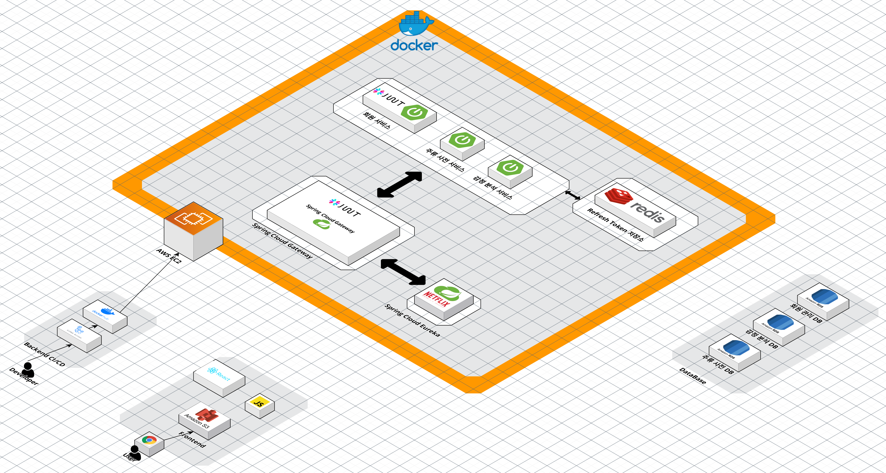

# Sunjoo Project 🍺

  
   
  <h3>🥂 사용자 기호 맞춤 주류 추천 서비스 🥂</h3>
    

     ✨ <a href="https://pinto-bakery-023.notion.site/SunJoo-c2dc53ede1d74825b0fa53f82d97b6aa?pvs=4">팀 노션</a>
  

   

 

### 📜 목차
---
1. [**프로젝트 일정**](#1)
2. [**서비스 소개**](#2)
3. [**주요 기능**](#3)
4. [**기술 스택**](#4)
5. [**산출물**](#5)
6. [**팀원 소개**](#6)
  

### 🗓️ 프로젝트 일정
---
- 일정: 2024년 5월 28일 - 2024년 7월 7일 (6주)
  

### 🔎 서비스 소개
---
Sunjoo는 사용자의 기분과 기호에 맞춰 최적의 주류를 추천해드리는 서비스입니다. 

간단한 텍스트 입력을 통해 사용자의 현재 감정을 분석하고, 그 결과를 바탕으로 적합한 주류를 추천해드립니다. 

<a href="https://github.com/pknu-wap/2023_1_WAT_BeJuRyu?tab=readme-ov-file">Bejuryu(version 1) repository</a>

 

### 🔎 주요 기능
---
- 감정 분석: 사용자가 입력한 텍스트를 분석하여 현재 감정을 파악합니다.
- 주류 추천: 감정 분석 결과에 따라 다양한 주류를 추천합니다. 예를 들어, 기쁨을 느낄 때는 축하할 만한 스파클링 와인, 차분함을 원할 때는 고요한 분위기에 어울리는 레드 와인 등을 제안합니다.
- 주류 검색: 원하는 주류를 직접 검색할 수 있으며, 다양한 필터를 사용하여 취향에 맞는 주류를 쉽게 찾을 수 있습니다.
- 맞춤형 피드백: 추천된 주류에 대한 사용자의 피드백을 받아 더욱 정교한 추천을 제공하도록 서비스가 지속적으로 개선됩니다.

 

### ⚒️ 기술 스택
---
- **frontend**

	 
	

- **Backend**

 	 
 	 
     

- **Infra**

     
      
    
    
    

- **DataBase**

  
    
    

 

### 📜 산출물
---
**🖋️아키텍처 구조도**

  

**🖋️ERD**
<table>
  <tr>
    <td align="center"> <b>Analysis-Result</b> </td>
    <td align="center"> <b>User</b> </td>
  </tr>
</table>
<table>

  <tr>
    <td align="center"> <b>Drinktionary</b> </td>
    
  </tr>

</table>

**🖋️주요 기능 결과 화면**
- **주류 리뷰 작성**  
   
- **주류 추천**  
   
 <u>Naver clova</u>를 활용하여 사용자가 입력한 텍스트를 분석하여 맞춤 주류를 추천해준다.
   

### 👥팀원 소개
> sunjoo는 **총 2명의 팀원**으로 구성되어 있습니다 😊  
수행 역할 상세 내용은 [팀 노션 페이지](https://pinto-bakery-023.notion.site/57025d050dc34ce5af2c95b03c8b3502?pvs=4)에서 확인하실 수 있습니다!

 
<!-- ALL-CONTRIBUTORS-LIST:START - Do not remove or modify this section -->
<!-- prettier-ignore-start -->
<!-- markdownlint-disable -->
<table>

  <tr>
    <td align="center"><a href="https://github.com/SunYerim"> <b>Yerim Sun</b></a> </td>
    <td align="center"><a href="https://github.com/baesunyoung6767"> <b>Sunyoung Bae</b></a> </td>

  </tr>
    <tr>
    <td align="center">프론트엔드</td>
    <td align="center">프론트엔드</td>
  </tr>
  </tr>
    <tr>
    <td align="center">백엔드</td>
    <td align="center">백엔드</td>

  </tr>
</table>

<!-- markdownlint-restore -->
<!-- prettier-ignore-end -->

<!-- ALL-CONTRIBUTORS-LIST:END -->
